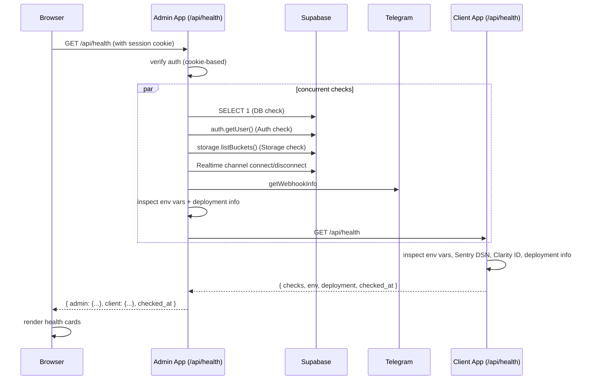

# Design Document: Admin Health Dashboard

## Overview

The Admin Health Dashboard adds a "Система" tab to the existing `/settings` page in the admin app. It gives the admin a single place to verify that all critical services are operational across both the admin and client apps.

The feature consists of three parts:
1. **Admin Health API** (`GET /api/health` in admin app) — server-side checks for Supabase, external services, env vars, and deployment info; also calls the Client Health API and aggregates results.
2. **Client Health API** (`GET /api/health` in client app) — server-side checks for client-side services, env vars, and deployment info; public endpoint.
3. **Health Dashboard UI** — a new tab in the Settings page that fetches from the Admin Health API and renders results using Shadcn UI components.

All sensitive checks run server-side. The browser only receives presence indicators and status values — never raw credentials or env var values.

---

## Architecture



---

## Components and Interfaces

### Admin Health API — `apps/admin/src/app/api/health/route.ts`

```ts
export async function GET(): Promise<NextResponse<AdminHealthResponse>>
```

Auth: cookie-based session via `createClient()` from `@/lib/supabase/server`. Returns 401 if no valid session.

Runs all checks concurrently with `Promise.allSettled`. Each check is wrapped in a `runCheck()` helper that catches exceptions and returns `{ service, status: "error", latency_ms: null, detail: message }`.

Calls `NEXT_PUBLIC_CLIENT_URL + "/api/health"` with a 9-second timeout (leaving 1s buffer within the 10s total budget).

### Client Health API — `apps/client/src/app/api/health/route.ts`

```ts
export async function GET(): Promise<NextResponse<ClientHealthResponse>>
```

No auth. Runs client checks concurrently. Returns structured JSON.

### Shared Types

Defined in each app locally (not in `@udo-craft/shared` since they're internal API contracts):

```ts
type CheckStatus = "ok" | "degraded" | "error";

interface HealthCheck {
  service: string;
  status: CheckStatus;
  latency_ms: number | null;
  detail: string | null;
}

interface DeploymentInfo {
  env: string;          // VERCEL_ENV ?? "local"
  url: string | null;   // VERCEL_URL
  sha: string | null;   // VERCEL_GIT_COMMIT_SHA (first 7 chars)
  message: string | null; // VERCEL_GIT_COMMIT_MESSAGE
}

interface AdminHealthResponse {
  checked_at: string; // ISO timestamp
  admin: {
    checks: HealthCheck[];
    env: Record<string, boolean>;
    deployment: DeploymentInfo;
  };
  client: {
    checks: HealthCheck[];
    env: Record<string, boolean>;
    deployment: DeploymentInfo;
  } | { status: "error"; detail: string; checks: HealthCheck[] };
}

interface ClientHealthResponse {
  checked_at: string;
  checks: HealthCheck[];
  env: Record<string, boolean>;
  deployment: DeploymentInfo;
}
```

### Health Dashboard UI — `apps/admin/src/app/(dashboard)/settings/page.tsx`

Adds a fourth tab `{ key: "system", icon: Activity, label: "Система" }` to the existing `TABS` array.

New sub-component: `SystemTab` — a client component that:
- On mount, fetches `GET /api/health`
- Shows `<Skeleton>` cards while loading
- Renders results grouped into Admin and Client sections
- Provides an "Оновити" button

---

## Data Models

### Admin env vars inspected (8 keys)

```ts
const ADMIN_ENV_VARS = [
  "NEXT_PUBLIC_SUPABASE_URL",
  "NEXT_PUBLIC_SUPABASE_ANON_KEY",
  "SUPABASE_SERVICE_ROLE_KEY",
  "NEXT_PUBLIC_APP_URL",
  "NEXT_PUBLIC_CLIENT_URL",
  "TELEGRAM_BOT_TOKEN",
  "TELEGRAM_WEBHOOK_SECRET",
  "NEXT_PUBLIC_SENTRY_DSN",
] as const;
```

### Client env vars inspected (5 keys)

```ts
const CLIENT_ENV_VARS = [
  "NEXT_PUBLIC_SUPABASE_URL",
  "NEXT_PUBLIC_SUPABASE_ANON_KEY",
  "SUPABASE_SERVICE_ROLE_KEY",
  "NEXT_PUBLIC_APP_URL",
  "NEXT_PUBLIC_SENTRY_DSN",
] as const;
```

### Clarity IDs (hardcoded in config, not env vars)

```ts
// apps/admin — already in layout.tsx
const ADMIN_CLARITY_ID = "w6t8md9b3l";

// apps/client — already in layout.tsx
const CLIENT_CLARITY_ID = "w7kk9avzfh";
```

The admin health check reads the admin Clarity ID from a config constant. The client health check reads the client Clarity ID from a config constant in the client app.

### Check execution helper

```ts
async function runCheck(
  service: string,
  fn: () => Promise<Omit<HealthCheck, "service">>
): Promise<HealthCheck> {
  try {
    const result = await fn();
    return { service, ...result };
  } catch (err) {
    return {
      service,
      status: "error",
      latency_ms: null,
      detail: err instanceof Error ? err.message : "Unknown error",
    };
  }
}
```

### Supabase checks

- **DB**: `createClient(url, serviceKey)` → `from('leads').select('id').limit(1)` — measures round-trip latency with `Date.now()`.
- **Auth**: `supabase.auth.admin.listUsers({ perPage: 1 })` — verifies non-error response.
- **Storage**: `supabase.storage.listBuckets()` — verifies non-error response.
- **Realtime**: Creates a channel, subscribes, waits for `SUBSCRIBED` status within 5s, then unsubscribes. Uses a `Promise` with a 5s timeout.

### Telegram check

```
GET https://api.telegram.org/bot{TELEGRAM_BOT_TOKEN}/getWebhookInfo
```

- Response `result.url` non-empty → `ok`, detail = webhook URL
- Response `result.url` empty → `degraded`, detail = "No webhook registered"
- API error → `degraded`, detail = Telegram error description
- Token missing → `error`, detail = "Bot token not configured"

### Sentry check (both apps)

```ts
function checkSentryDsn(dsn: string | undefined): HealthCheck {
  if (!dsn) return { status: "error", detail: "DSN not configured", latency_ms: null };
  try {
    new URL(dsn);
    return { status: "ok", detail: null, latency_ms: null };
  } catch {
    return { status: "error", detail: "DSN not configured", latency_ms: null };
  }
}
```

### Clarity check (both apps)

```ts
function checkClarityId(id: string | undefined): HealthCheck {
  if (id && id.length > 0) return { status: "ok", detail: null, latency_ms: null };
  return { status: "degraded", detail: "Clarity ID not found in config", latency_ms: null };
}
```

---

## Correctness Properties

*A property is a characteristic or behavior that should hold true across all valid executions of a system — essentially, a formal statement about what the system should do. Properties serve as the bridge between human-readable specifications and machine-verifiable correctness guarantees.*

### Property 1: Response shape invariant

*For any* authenticated request to the Admin Health API, regardless of which individual checks succeed or fail, the response always contains an `admin` object with a `checks` array and a `client` object with a `checks` array, where every entry in each array has `service` (string), `status` ("ok" | "degraded" | "error"), `latency_ms` (number or null), and `detail` (string or null).

**Validates: Requirements 2.3, 2b.3**

### Property 2: Fault isolation — any failing check does not affect others

*For any* subset of service checks that throw exceptions, those checks have `status: "error"` in the response, and all non-throwing checks retain their correct computed status. No single check failure causes the entire API to fail.

**Validates: Requirements 2.4, 2b.4**

### Property 3: Client unreachability propagates to entire client section

*For any* failure mode when calling the Client Health API (network error, timeout, non-2xx response), the `client` section in the Admin Health API response has `status: "error"` and the `checks` array contains exactly one entry reflecting the error.

**Validates: Requirements 2c.1**

### Property 4: Env map completeness and boolean values

*For any* combination of set and unset environment variables, the `env` map in both the admin and client sections always contains exactly the expected set of keys (8 for admin, 5 for client), and every value is a boolean (`true` if set, `false` if missing) — never the actual variable value.

**Validates: Requirements 5.1, 5.2, 5.3, 5b.1, 5b.2, 5b.3**

### Property 5: Sentry DSN validation is a total function over all strings

*For any* string input as a Sentry DSN (including empty string, whitespace, non-URL strings, and valid URLs), the check function returns `"ok"` if and only if the string is a valid URL, and `"error"` otherwise.

**Validates: Requirements 4.1, 5c.1**

### Property 6: Status badge color mapping is total and correct

*For any* `HealthCheck` result with status `"ok"`, `"degraded"`, or `"error"`, the rendered `StatusBadge` component applies green, yellow, or red styling respectively — with no status value left unmapped.

**Validates: Requirements 7.1**

### Property 7: Latency display for Supabase checks

*For any* Supabase check result where `latency_ms` is a non-null number, the rendered check row includes the latency value in milliseconds. For any check where `latency_ms` is null, no latency value is displayed.

**Validates: Requirements 7.2**

### Property 8: checked_at timestamp formatting

*For any* valid ISO 8601 timestamp string returned in `checked_at`, the formatted display string is a non-empty, human-readable local date and time string (not the raw ISO string).

**Validates: Requirements 7.5**

---

## Error Handling

| Scenario | Behavior |
|---|---|
| Unauthenticated request to Admin Health API | 401 JSON response |
| `NEXT_PUBLIC_CLIENT_URL` not set | `client` section → `error`, detail: "NEXT_PUBLIC_CLIENT_URL not configured" |
| Client app unreachable / timeout | `client` section → `error`, detail: "Client app unreachable" |
| Missing Supabase credentials | All 4 Supabase checks → `error`, detail: "Missing Supabase credentials" |
| Individual check throws | That check → `error` with exception message; others unaffected |
| Realtime connection timeout (>5s) | Supabase Realtime check → `error`, detail: "Connection timeout" |
| Telegram token missing | Telegram check → `error`, detail: "Bot token not configured" |
| Telegram API error response | Telegram check → `degraded`, detail: Telegram error description |
| Sentry DSN absent or invalid URL | Sentry check → `error`, detail: "DSN not configured" |
| Clarity ID absent | Clarity check → `degraded`, detail: "Clarity ID not found in config" |
| Admin Health API returns non-2xx | UI shows error message; "Оновити" button enabled |
| `VERCEL_ENV` not set | `deployment.env` → `"local"` |
| `VERCEL_GIT_COMMIT_SHA` not set | `deployment.sha` → `null`; UI displays `"—"` |

---

## Testing Strategy

This feature spans server-side API logic and client-side UI rendering. PBT applies to the pure logic layer (check functions, response shape invariants, env map construction, DSN validation, badge rendering). Infrastructure integration (actual Supabase, Telegram, network calls) uses example-based integration tests.

### Unit / Property Tests

Use **fast-check** (already compatible with the TypeScript/Jest/Vitest stack) for property-based tests.

Each property test runs a minimum of 100 iterations.

**Property 1 — Response shape invariant**
Tag: `Feature: admin-health-dashboard, Property 1: response shape invariant`
Generate arbitrary combinations of check outcomes (ok/degraded/error, with/without latency). Assert the response always has the required shape.

**Property 2 — Fault isolation**
Tag: `Feature: admin-health-dashboard, Property 2: fault isolation`
Generate a random subset of checks that throw. Assert throwing checks → `"error"`, non-throwing checks → their correct status.

**Property 3 — Client unreachability**
Tag: `Feature: admin-health-dashboard, Property 3: client unreachability`
Generate various failure modes for the client fetch (throw, non-2xx status codes). Assert client section always has `status: "error"` with a single checks entry.

**Property 4 — Env map completeness**
Tag: `Feature: admin-health-dashboard, Property 4: env map completeness`
Generate arbitrary subsets of set/unset env vars. Assert the map always has exactly the expected keys and boolean values.

**Property 5 — Sentry DSN validation**
Tag: `Feature: admin-health-dashboard, Property 5: sentry DSN validation`
Generate arbitrary strings (empty, whitespace, random, valid URLs). Assert `checkSentryDsn` returns `"ok"` iff the string is a valid URL.

**Property 6 — Status badge color mapping**
Tag: `Feature: admin-health-dashboard, Property 6: status badge color mapping`
Generate arbitrary `HealthCheck` objects. Assert the rendered badge has the correct color class for each status.

**Property 7 — Latency display**
Tag: `Feature: admin-health-dashboard, Property 7: latency display`
Generate Supabase check results with arbitrary latency_ms values (null and non-null). Assert display presence/absence matches nullability.

**Property 8 — Timestamp formatting**
Tag: `Feature: admin-health-dashboard, Property 8: checked_at timestamp formatting`
Generate arbitrary valid ISO timestamps. Assert the formatted output is a non-empty string different from the raw ISO input.

### Example-Based Unit Tests

- Auth check: unauthenticated → 401, authenticated → 200
- `checked_at` field: present and valid ISO string in every response
- Telegram check: mock API with url → ok; without url → degraded; API error → degraded
- Clarity check: ID present → ok; ID absent → degraded
- Deployment info: VERCEL_ENV unset → "local"; SHA unset → null
- UI: skeleton shown during fetch; hidden after response
- UI: "Оновити" button triggers re-fetch
- UI: non-2xx API response → error message shown
- UI: client unreachable → single error card, no sub-sections

### Integration Tests

- Supabase Realtime connect/disconnect lifecycle (mocked channel)
- Full Admin Health API response with all services mocked — verify all check names present
- Client Health API response shape with mocked services
- End-to-end: Admin Health API calls Client Health API (both running locally)

### Edge Case Tests

- `NEXT_PUBLIC_CLIENT_URL` not set → client section error
- All Supabase env vars missing → all 4 checks error
- `TELEGRAM_BOT_TOKEN` not set → Telegram check error
- `VERCEL_GIT_COMMIT_SHA` not set → UI shows "—"
- `VERCEL_ENV` not set → UI shows "local"
