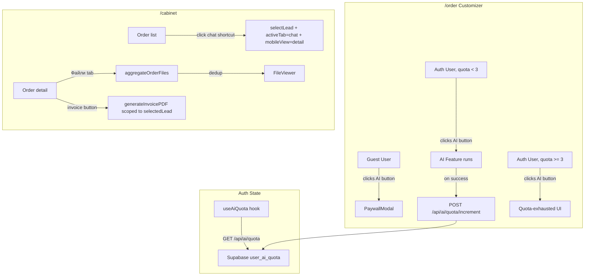

# Design Document — client-ai-paywall-cabinet

## Overview

This document covers the technical design for two related enhancements to `apps/client`:

**Feature 1 — AI Features Paywall:** Gate the three AI tools in the `/order` customizer (AI Illustration Generation, Drawing Improvement, and "Приміряти на людину" try-on) behind Supabase Auth. Introduce a per-user free-usage quota of 3 AI generations persisted in a new `user_ai_quota` Postgres table.

**Feature 2 — Cabinet Order History Enhancements:** Add three capabilities to the `/cabinet` order detail view: a "Файли" tab aggregating all files associated with an order, a working per-order invoice download button, and a "Написати менеджеру" shortcut on each order list entry.

Both features are confined to `apps/client`. No changes to `apps/admin` or shared packages are required.

---

## Architecture

### High-Level Flow



### Auth State Threading Strategy

The customizer currently has no concept of auth state — it is a pure product editor. The cleanest approach is a **dedicated hook** (`useAiQuota`) that encapsulates all quota logic, combined with a single `isAuthenticated: boolean` prop threaded down from the page level.

**Decision: prop drilling (not Context)**

Rationale:
- The auth check is needed in exactly three leaf components: `AIIllustrationSection` (inside `PrintsPanel`), `DrawingModal`, and the try-on button in `Customizer`.
- Adding a React Context for a single boolean would add indirection without benefit.
- The prop chain is shallow: `Customizer` → `PrintsPanel` → `AIIllustrationSection` (2 hops), and `Customizer` → `DrawingModal` (1 hop, via `DrawPanel`).
- The `useAiQuota` hook is instantiated once in `Customizer` and its state is passed down alongside `isAuthenticated`.

```
order/page.tsx
  └─ Customizer (receives isAuthenticated, aiQuota from useAiQuota)
       ├─ PrintsPanel (receives isAuthenticated, aiQuota)
       │    └─ AIIllustrationSection (receives isAuthenticated, aiQuota)
       ├─ DrawPanel → DrawingModal (receives isAuthenticated, aiQuota)
       └─ try-on button (reads isAuthenticated, aiQuota inline)
```

---

## Components and Interfaces

### 1. `PaywallModal`

**Location:** `apps/client/src/components/PaywallModal.tsx`

A modal overlay shown to guest users when they attempt to use any AI feature. It does not navigate away — the customizer remains mounted and interactive behind the overlay.

```tsx
interface PaywallModalProps {
  open: boolean;
  onClose: () => void;
}
```

**Behavior:**
- Renders as a fixed overlay (`z-[10010]`) with a semi-transparent backdrop.
- Contains:
  - Heading: "Для використання AI потрібна реєстрація"
  - Body text explaining the free quota (3 generations).
  - "Увійти" button → `router.push("/cabinet/login")`
  - "Зареєструватись" button → `router.push("/cabinet/login?mode=register")`
  - Dismiss button (×) that calls `onClose`.
- Dismissible via the × button, backdrop click, or Escape key.
- Does NOT redirect — `onClose` simply hides the modal.

**Design note:** The modal is a standalone component (not co-located with the customizer) so it can be reused if other paywalled features are added later.

---

### 2. `useAiQuota` hook

**Location:** `apps/client/src/hooks/useAiQuota.ts`

Encapsulates all client-side quota state. Instantiated once in `Customizer` (or `order/page.tsx`) and passed down as props.

```ts
interface AiQuotaState {
  attemptsUsed: number;       // current count from server
  limit: number;              // always 3
  isExhausted: boolean;       // attemptsUsed >= limit
  loading: boolean;           // true while fetching
  increment: () => Promise<void>; // call after successful AI generation
}

function useAiQuota(isAuthenticated: boolean): AiQuotaState
```

**Behavior:**
- On mount (when `isAuthenticated === true`): fetches `GET /api/ai/quota` and sets `attemptsUsed`.
- If the user is not authenticated: returns `{ attemptsUsed: 0, limit: 3, isExhausted: false, loading: false }` — no fetch.
- `increment()`: calls `POST /api/ai/quota/increment` and updates local state with the returned value.
- If `GET /api/ai/quota` returns 404 (no row yet), treats `attemptsUsed` as 0.

---

### 3. Auth state in `order/page.tsx`

**Location:** `apps/client/src/app/order/page.tsx` (or `_main.tsx`)

The order page already uses a client component. Add a `useEffect` that calls `supabase.auth.getUser()` on mount (same pattern as `cabinet/page.tsx`) and stores `isAuthenticated: boolean` in state. Pass this and the `useAiQuota` result into `Customizer`.

```tsx
// In order page / _main.tsx
const [isAuthenticated, setIsAuthenticated] = useState(false);
const aiQuota = useAiQuota(isAuthenticated);

useEffect(() => {
  supabase.auth.getUser().then(({ data }) => {
    setIsAuthenticated(!!data.user);
  });
}, []);
```

---

### 4. Updated `Customizer` props

Add two new props:

```ts
interface CustomizerProps {
  // ... existing props ...
  isAuthenticated: boolean;
  aiQuota: AiQuotaState;
}
```

The `Customizer` component passes these down to `PrintsPanel`, `DrawPanel` (which passes to `DrawingModal`), and reads them inline for the try-on button.

---

### 5. Updated `AIIllustrationSection`

Receives `isAuthenticated` and `aiQuota`. The "Згенерувати" button handler becomes:

```ts
const handleGenerate = () => {
  if (!isAuthenticated) { setPaywallOpen(true); return; }
  if (aiQuota.isExhausted) return; // button is disabled anyway
  // ... existing generation logic ...
  // on success:
  await aiQuota.increment();
};
```

When `aiQuota.isExhausted` is true, the button is replaced with a quota-exhausted message (inline, below the textarea). The message does NOT disable the rest of the customizer.

---

### 6. Updated `DrawingModal`

Receives `isAuthenticated` and `aiQuota`. The "Покращити з AI" button handler:

```ts
const handleEnhanceAndPaste = async () => {
  if (!isAuthenticated) { setPaywallOpen(true); return; }
  if (aiQuota.isExhausted) { /* show inline message */ return; }
  // ... existing enhance logic ...
  // on success:
  await aiQuota.increment();
};
```

---

### 7. Updated try-on button in `Customizer`

```tsx
<button
  onClick={() => {
    if (!isAuthenticated) { setPaywallOpen(true); return; }
    setAiDrawerOpen(true);
  }}
  // ...
>
```

`GenerationDrawer` also receives `aiQuota` so it can show the exhausted state and call `increment()` on success.

---

### 8. Cabinet — "Файли" tab

**Location:** `apps/client/src/app/cabinet/page.tsx`

The existing detail panel has a `showInfo` side panel. The requirements call for a proper tab structure: `details | chat | files`. The current implementation uses `showInfo` as a toggle rather than a tab. The design introduces a proper `activeTab` state for the detail panel (distinct from the existing `activeTab` which is already used for `"details" | "chat" | "files"` — checking the code, `activeTab` is already typed as `"details" | "chat" | "files"` but the "files" tab is not yet rendered).

**`aggregateOrderFiles` utility:**

```ts
// apps/client/src/lib/aggregateOrderFiles.ts

export function aggregateOrderFiles(
  lead: Lead,
  messages: Message[]
): string[] {
  const urls = new Set<string>();

  // Source 1: order_items.custom_print_url
  for (const item of lead.order_items ?? []) {
    if (item.custom_print_url) urls.add(item.custom_print_url);
  }

  // Source 2: messages.attachments where sender = 'client'
  for (const msg of messages) {
    if (msg.sender === "client" && msg.attachments) {
      for (const url of msg.attachments) {
        urls.add(url);
      }
    }
  }

  return Array.from(urls);
}
```

**Files tab rendering:**

When `activeTab === "files"`, the detail panel renders:
- If `files.length === 0`: a centered "Файли відсутні" placeholder with a `FolderOpen` icon.
- Otherwise: a responsive grid of file thumbnails/links.
  - Image URLs (`isImage(url)`): rendered as `` thumbnails that call `setViewerUrl(url)` on click.
  - Non-image URLs: rendered as labelled file links (filename extracted from URL) that call `setViewerUrl(url)` on click.

The `files` array is derived via `useMemo(() => aggregateOrderFiles(selectedLead, messages), [selectedLead, messages])`.

---

### 9. Cabinet — Invoice button

The invoice button already exists in the `showInfo` side panel. The design moves it to the main detail view (visible regardless of `showInfo`) and ensures it is always scoped to `selectedLead` at the time of click.

The existing `handleDownloadInvoice` function already reads `selectedLead` from closure — it is correctly scoped. The only change needed is:
1. Move the button out of the `showInfo` panel into the `"details"` tab content.
2. Ensure `generatingPdf` state is reset per-lead (it already is, since it's a simple boolean).

No logic changes are needed to `generateInvoicePDF` itself.

---

### 10. Cabinet — "Написати менеджеру" shortcut

Add a `MessageCircle` icon button to each lead list item. The click handler:

```ts
const handleChatShortcut = (lead: Lead) => {
  setSelectedLead(lead);
  setActiveTab("chat");
  setMobileView("detail");
  setUnreadByLead((prev) => ({ ...prev, [lead.id]: 0 }));
};
```

This is a single atomic state update sequence. The unread badge is shown on the shortcut button when `unreadByLead[lead.id] > 0`.

---

## Data Models

### `user_ai_quota` table

```sql
CREATE TABLE user_ai_quota (
  user_id      UUID PRIMARY KEY REFERENCES auth.users(id) ON DELETE CASCADE,
  attempts_used INTEGER NOT NULL DEFAULT 0,
  updated_at   TIMESTAMPTZ NOT NULL DEFAULT now()
);
```

**Notes:**
- `user_id` is the primary key (one row per user, no separate `id` column needed).
- `attempts_used` starts at 0 and is incremented server-side only.
- `updated_at` is updated on every increment via `now()`.
- No `created_at` column — `updated_at` serves as both.

### RLS Policies

```sql
ALTER TABLE user_ai_quota ENABLE ROW LEVEL SECURITY;

-- Users can read their own row
CREATE POLICY "quota_select_own"
  ON user_ai_quota FOR SELECT TO authenticated
  USING (user_id = auth.uid());

-- Users can insert their own row (upsert on first generation)
CREATE POLICY "quota_insert_own"
  ON user_ai_quota FOR INSERT TO authenticated
  WITH CHECK (user_id = auth.uid());

-- Users can update their own row
CREATE POLICY "quota_update_own"
  ON user_ai_quota FOR UPDATE TO authenticated
  USING (user_id = auth.uid())
  WITH CHECK (user_id = auth.uid());
```

**Note:** The API routes use the server-side Supabase client (session-based, not service role) so RLS applies automatically. The increment endpoint uses an upsert to handle the "no row yet" case atomically.

### API Routes

#### `GET /api/ai/quota`

**Location:** `apps/client/src/app/api/ai/quota/route.ts`

```ts
// Response
{ attempts_used: number; limit: number }

// Auth: requires valid session → 401 if missing
// If no row exists for user: returns { attempts_used: 0, limit: 3 }
```

Implementation uses `supabase.from("user_ai_quota").select("attempts_used").eq("user_id", user.id).maybeSingle()`. If `data` is null, returns `{ attempts_used: 0, limit: 3 }`.

#### `POST /api/ai/quota/increment`

**Location:** `apps/client/src/app/api/ai/quota/increment/route.ts`

```ts
// Response
{ attempts_used: number; limit: number }

// Auth: requires valid session → 401 if missing
```

Implementation uses an upsert with increment:

```sql
INSERT INTO user_ai_quota (user_id, attempts_used, updated_at)
VALUES ($user_id, 1, now())
ON CONFLICT (user_id)
DO UPDATE SET
  attempts_used = user_ai_quota.attempts_used + 1,
  updated_at = now()
RETURNING attempts_used;
```

In Supabase JS client this is expressed as:

```ts
const { data, error } = await supabase.rpc("increment_ai_quota", { p_user_id: user.id });
```

Or via raw SQL through `supabase.from("user_ai_quota").upsert(...)` with a custom RPC. The RPC approach is preferred to avoid race conditions.

**Alternative (no RPC):** Use the Supabase service role client in the API route to bypass RLS and perform the upsert directly, since the route already validates the session:

```ts
// Using service role client for atomic upsert
const serviceSupabase = createServiceClient();
const { data } = await serviceSupabase
  .from("user_ai_quota")
  .upsert({ user_id: user.id, attempts_used: 1, updated_at: new Date().toISOString() }, {
    onConflict: "user_id",
    ignoreDuplicates: false,
  })
  // This doesn't do increment — need RPC or raw SQL
```

**Decision:** Use a Postgres function `increment_ai_quota(p_user_id uuid)` to ensure atomicity. The function is included in the migration.

---

## Correctness Properties

*A property is a characteristic or behavior that should hold true across all valid executions of a system — essentially, a formal statement about what the system should do. Properties serve as the bridge between human-readable specifications and machine-verifiable correctness guarantees.*

### Property 1: Quota increment is monotonically increasing

*For any* authenticated user with a current `attempts_used` value of `n`, calling `POST /api/ai/quota/increment` SHALL return `{ attempts_used: n + 1 }`.

**Validates: Requirements 2.2, 3.3**

---

### Property 2: Quota gate — enabled below limit

*For any* `attempts_used` value in `[0, 1, 2]` (i.e., strictly less than the Free_Tier_Limit of 3), the AI feature UI SHALL be in an enabled state (the generate/enhance button is not disabled and no quota-exhausted message is shown).

**Validates: Requirements 2.4**

---

### Property 3: Quota gate — exhausted at or above limit

*For any* `attempts_used` value `>= 3` (the Free_Tier_Limit), the AI feature UI SHALL display the quota-exhausted message and the generate/enhance button SHALL be disabled.

**Validates: Requirements 2.5**

---

### Property 4: Quota is shared across all AI features

*For any* of the three AI features (AIIllustrationSection, DrawingModal enhance, GenerationDrawer), a successful generation SHALL increment the same `user_ai_quota.attempts_used` counter — the counter is not per-feature.

**Validates: Requirements 2.7**

---

### Property 5: Quota increment only on success

*For any* AI generation attempt that results in a non-OK response from `/api/ai/generate`, `POST /api/ai/quota/increment` SHALL NOT be called. Only successful generations (2xx response with a `dataUrl`) trigger the increment.

**Validates: Requirements 2.9**

---

### Property 6: File aggregation deduplication

*For any* lead and its associated messages, the result of `aggregateOrderFiles(lead, messages)` SHALL contain each URL at most once, regardless of how many times that URL appears across `order_items.custom_print_url` values and `messages.attachments` arrays.

**Validates: Requirements 4.4**

---

### Property 7: File aggregation completeness — order items

*For any* lead whose `order_items` contain non-null `custom_print_url` values, every such URL SHALL appear in the result of `aggregateOrderFiles(lead, messages)`.

**Validates: Requirements 4.2**

---

### Property 8: File aggregation completeness — client messages

*For any* lead and a set of messages where `sender === "client"` and `attachments` is non-empty, every attachment URL from those messages SHALL appear in the result of `aggregateOrderFiles(lead, messages)`.

**Validates: Requirements 4.3**

---

### Property 9: Invoice is scoped to selected lead

*For any* two distinct leads `A` and `B`, if lead `A` is currently selected and the invoice button is clicked, `generateInvoicePDF` SHALL be called with data derived from lead `A` — not lead `B` or any previously selected lead.

**Validates: Requirements 5.2, 5.6**

---

### Property 10: Invoice data completeness

*For any* selected lead with at least one `order_item`, the `InvoiceData` object passed to `generateInvoicePDF` SHALL contain: a non-empty `items` array (one entry per order item), a `contact` object with `name`, `email`, and `phone`, and a `createdAt` date.

**Validates: Requirements 5.3**

---

### Property 11: Chat shortcut selects lead and opens chat tab

*For any* lead in the cabinet order list, clicking its "Написати менеджеру" shortcut SHALL result in `selectedLead === that lead` AND `activeTab === "chat"` as a single atomic state transition.

**Validates: Requirements 6.2**

---

### Property 12: Chat shortcut resets unread count

*For any* lead with `unreadByLead[lead.id] > 0`, clicking its "Написати менеджеру" shortcut SHALL result in `unreadByLead[lead.id] === 0`.

**Validates: Requirements 6.4**

---

### Property 13: Unread badge visibility

*For any* lead with `unreadByLead[lead.id] > 0`, the rendered "Написати менеджеру" button for that lead SHALL include a visible badge displaying the unread count. *For any* lead with `unreadByLead[lead.id] === 0`, no badge SHALL be shown.

**Validates: Requirements 6.5**

---

## Error Handling

### Paywall / Auth

- If `supabase.auth.getUser()` fails on the order page, `isAuthenticated` defaults to `false` — the paywall is shown (safe default, not a silent failure).
- The `PaywallModal` does not depend on any async data — it renders immediately.

### Quota API

- `GET /api/ai/quota` — if the DB query fails, returns `{ attempts_used: 0, limit: 3 }` with a 200 (fail-open: don't block the user from trying AI if quota can't be read). Logs the error server-side.
- `POST /api/ai/quota/increment` — if the upsert fails, returns 500. The client (`useAiQuota.increment()`) catches the error silently (the generation already succeeded; failing to record the quota is a non-critical error). The error is logged to Sentry.
- If `increment()` fails, the local `attemptsUsed` state is NOT updated — the user may get one extra generation. This is acceptable for a free-tier feature.

### File Aggregation

- If `order_items` is undefined or null, `aggregateOrderFiles` returns an empty array (no crash).
- If a message's `attachments` field is null or not an array, it is skipped.
- Malformed URLs are included as-is — the `FileViewer` component handles display errors.

### Invoice

- If `generateInvoicePDF` throws, the `finally` block in `handleDownloadInvoice` resets `generatingPdf` to `false`. A `toast.error` is shown to the user.
- The invoice button is always rendered (per Requirement 5.5) even when `order_items` is empty — `generateInvoicePDF` handles zero-item invoices gracefully.

### Cabinet Chat Shortcut

- The `handleChatShortcut` function is synchronous state updates only — no async operations, no error cases.

---

## Testing Strategy

### Unit Tests

Focus on pure functions and specific UI behaviors:

- `aggregateOrderFiles`: test with various combinations of order items and messages, including duplicates, null values, and empty arrays.
- `PaywallModal`: renders with correct CTAs, dismisses on × click and backdrop click, Escape key closes it.
- `handleChatShortcut`: verify all three state updates occur (selectedLead, activeTab, mobileView, unreadByLead reset).
- `handleDownloadInvoice`: verify `generateInvoicePDF` is called with correct data for the selected lead.
- API routes: test 401 responses for unauthenticated requests, correct response shapes for authenticated requests.

### Property-Based Tests

Use **fast-check** (already compatible with the TypeScript/Jest/Vitest ecosystem) for the properties defined above. Each test runs a minimum of 100 iterations.

**Test file location:** `apps/client/src/__tests__/ai-paywall-cabinet.property.test.ts`

Key generators:
- `fc.integer({ min: 0, max: 10 })` for `attempts_used` values
- `fc.array(fc.webUrl())` for file URL collections
- `fc.record({ id: fc.uuid(), custom_print_url: fc.option(fc.webUrl()) })` for order items
- `fc.record({ sender: fc.constantFrom("client", "manager"), attachments: fc.array(fc.webUrl()) })` for messages

**Tag format:** `// Feature: client-ai-paywall-cabinet, Property N: <property text>`

Example:

```ts
// Feature: client-ai-paywall-cabinet, Property 6: File aggregation deduplication
it("aggregateOrderFiles never returns duplicate URLs", () => {
  fc.assert(
    fc.property(
      fc.array(fc.webUrl(), { maxLength: 10 }),
      fc.array(fc.webUrl(), { maxLength: 10 }),
      (printUrls, attachmentUrls) => {
        const lead = {
          order_items: printUrls.map((url) => ({ custom_print_url: url })),
        } as Lead;
        const messages = attachmentUrls.map((url) => ({
          sender: "client" as const,
          attachments: [url],
        })) as Message[];

        const result = aggregateOrderFiles(lead, messages);
        const unique = new Set(result);
        return unique.size === result.length;
      }
    ),
    { numRuns: 100 }
  );
});
```

### Integration Tests

- `GET /api/ai/quota` and `POST /api/ai/quota/increment` with a real Supabase test project (or mocked Supabase client).
- Verify RLS: a user cannot read or update another user's `user_ai_quota` row.
- Cabinet leads API: verify `order_items` are included in the response (needed for file aggregation).

### Smoke Tests

- `user_ai_quota` table exists with correct schema after migration.
- RLS policies are present on `user_ai_quota`.
- `GET /api/ai/quota` returns 401 for unauthenticated requests.
